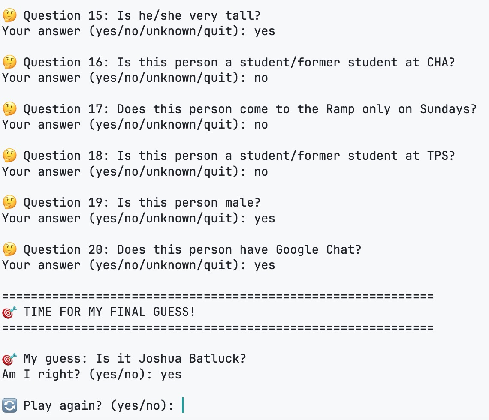

# 20Q

A simple Twenty Questions game, with Rampions.

Demo:

# Usage

Run main.py to start the game. The game includes Rampion questions, but you can change them for your own games. It's really easy.

As you answer more questions and fill in more people, the guesser would get smarter!
